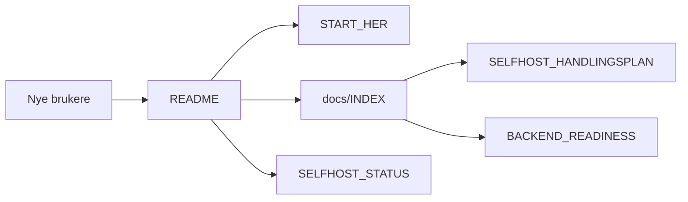
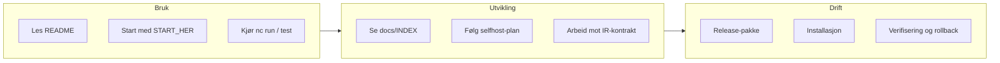

# Norscode

Et norsk programmeringsspråk med native-first CLI, selfhost-bane og modulær verktøykjede.


## Kort Fortalt

- Norsk syntaks for funksjoner, kontrollflyt og uttrykk
- Statisk typing for heltall, tekst, bool, lister og ordbøker
- Modul- og pakke-system
- Standardbiblioteket `std`
- Feilhåndtering med `kast`, `prøv` og `fang`
- Native-first pipeline for bygg, testing og kjøring

## Oversikt



## Veikart



## Eksempel

```norscode
funksjon start() -> heltall {
    skriv("Hei, Norscode!")
    returner 0
}
```

Kjør et program med:

```bash
./bin/nc run app.no
```

## Rask start

### macOS / Linux

```bash
curl -fsSL https://raw.githubusercontent.com/Norscode/Norscode/main/tools/install.sh | sh
./bin/nc --help
./bin/nc run app.no
./bin/nc test
```

### Windows

```powershell
irm https://raw.githubusercontent.com/Norscode/Norscode/main/tools/install.ps1 | iex
.\bin\nc.ps1 --help
.\bin\nc.ps1 run app.no
```

Hvis du starter fra kildekode i repoet, bygg native binary først:

```bash
bash tools/build_norscode_native.sh
./bin/nc --help
```

**CI / stage-0:** GitHub Actions trenger `dist/norscode_native` (NORSCODE_CMD-runtime). Legg binær i
[bootstrap/stage0/](bootstrap/stage0/README.md) eller publiser GitHub Release — uten dette feiler
`tools/build_norscode_native.sh` etter release-nedlasting.

## Vanlige kommandoer

```bash
./bin/nc run app.no
./bin/nc check app.no
./bin/nc test
./bin/nc lint app.no
./bin/nc format app.no
./bin/nc bench
./bin/nc smoke
./bin/nc serve-e2e
./bin/nc stress
./bin/nc security
./bin/nc diagnose
./bin/nc fuzz
./bin/nc ir-disasm path/to/program.nlir --strict
./bin/nc ci --require-selfhost-ready
```

## Installasjon og release

- Plattformguide: [docs/WINDOWS.md](docs/WINDOWS.md)
- Startreise: [docs/START_HER.md](docs/START_HER.md)
- CLI-kontrakt: [docs/CLI_CONTRACT.md](docs/CLI_CONTRACT.md)
- Backend-status: [docs/BACKEND_READINESS.md](docs/BACKEND_READINESS.md)

Lokal release-pakke:

```bash
bash package-release.sh
bash tools/install-release.sh release-artifacts/norscode-language-*.tar.gz
```

## Dokumentasjon

- [docs/INDEX.md](docs/INDEX.md) - dokumentasjonsportal
- [docs/START_HER.md](docs/START_HER.md) - raskeste vei inn
- [docs/COOKBOOK.md](docs/COOKBOOK.md) - praktiske oppskrifter
- [docs/EXAMPLES.md](docs/EXAMPLES.md) - representative eksempler
- [docs/SELFHOST_HANDLINGSPLAN.md](docs/SELFHOST_HANDLINGSPLAN.md) - aktiv plan
- [docs/SELFHOST_STATUS.md](docs/SELFHOST_STATUS.md) - status
- [docs/SELFHOST_RELEASE_CHECKLIST.md](docs/SELFHOST_RELEASE_CHECKLIST.md) - release-sjekkliste
- [docs/HANDOFF.md](docs/HANDOFF.md) - kort overlevering
- [docs/LANE_MAP.md](docs/LANE_MAP.md) - aktiv vei, legacy og arkiv
- [docs/ARCHIVE_INDEX.md](docs/ARCHIVE_INDEX.md) - historikk
- [docs/FRONTEND_LEARNING_PATH.md](docs/FRONTEND_LEARNING_PATH.md) - frontend-lesesti
- [docs/BACKEND_READINESS.md](docs/BACKEND_READINESS.md) - backend-status

## Selvhost og status

Norscode har en aktiv selfhost-bane i `selfhost/`, og normal bruk er native-first.
For dagens status og videre arbeid, se:

- [docs/SELFHOST_STATUS.md](docs/SELFHOST_STATUS.md)
- [docs/SELFHOST_HANDLINGSPLAN.md](docs/SELFHOST_HANDLINGSPLAN.md)
- [docs/MAINTENANCE_POLICY.md](docs/MAINTENANCE_POLICY.md)

## Struktur

```text
.
├── bin/
├── compiler/
├── docs/
├── examples/
├── selfhost/
├── std/
├── tests/
└── app.no
```

## Status

- `./bin/nc test` er grønn
- IR snapshot-parity er grønn for de dekkede tilfellene
- selfhost-banen dekker kjernefunksjonene som brukes i testløpet
- release, installasjon og oppgradering er dokumentert og verifiserbar

## Historikk

Noen milepæler som er nyttige å kjenne til:

- v17: første AST til bytecode-backend
- v18: eksplisitt AST-bro mellom parser og bytecode
- v19-v22: selfhost-broen ble utvidet med eksport, `IfExpr` og index assignment
- v24-v26: selfhost-kjeden ble koblet til imports og bredere testsett
- v27-v36: flere parser- og VM-fikser for strenger, operatorer, tracing og ytelse
- v37-v43: videre diagnose- og parity-arbeid for selfhost-kjeden

## Videre lesing

- [docs/CLI_CONTRACT.md](docs/CLI_CONTRACT.md)
- [docs/QUALITY.md](docs/QUALITY.md)
- [docs/DEPLOYMENT_PLAYBOOK.md](docs/DEPLOYMENT_PLAYBOOK.md)
- [docs/MAINTENANCE_POLICY.md](docs/MAINTENANCE_POLICY.md)

## Lisens

Apache-2.0. Se [LICENSE](LICENSE).

## Forfatter

Jan Steinar Sætre
