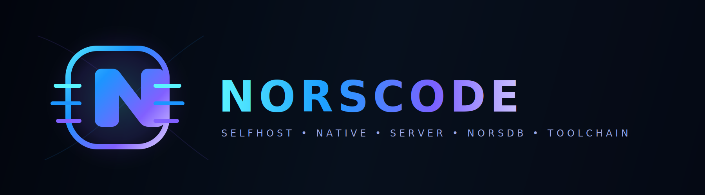

# Norscode

Norscode er eit norsk språk- og verktøysett med native-first CLI, selfhost-løype og ei aktiv flate utan Python eller C.




## Kort fortalt

- Norsk syntaks for funksjonar, kontrollflyt og uttrykk
- Statisk typing for heiltal, tekst, bool, lister og ordbøker
- Modul- og pakke-system
- Standardbiblioteket `std`
- Feilhandtering med `kast`, `prøv` og `fang`
- Normal kjede: `.no` -> NCB JSON -> `selfhost/vm.no`

## Kom i gang

1. Les [docs/INDEX.md](docs/INDEX.md)
2. Installer med [INSTALL.md](INSTALL.md)
3. Bruk [docs/USER_MANUAL.md](docs/USER_MANUAL.md) som praktisk manual
4. Følg [docs/LEARNING_GUIDE.md](docs/LEARNING_GUIDE.md) for opplæring
5. Bruk [docs/LANE_MAP.md](docs/LANE_MAP.md) for riktig arbeidsløype
6. Les [docs/SELFHOST_HANDLINGSPLAN.md](docs/SELFHOST_HANDLINGSPLAN.md) for selfhost-løypa
7. Sjekk [docs/STATUS.md](docs/STATUS.md)
8. Vedlikehald: `./bin/nc maintenance verify`

Snarvegar:

```bash
./bin/nc --help
./bin/nc run app.no
./bin/nc check app.no
./bin/nc feature-check app.no
./bin/nc test
```

## Normal bruk

- `./bin/nc` og `dist/norscode_native` er normal CLI og runtime
- `./bin/nc feature-check [fil.no ...]` er standard gate for å byggje nye funksjonar direkte i Norscode
- `./bin/nc maintenance verify` gir vedlikehaldssamandrag
- `./bin/nc maintenance status`, `lane`, `seed`, `seed-status` viser Norscode-vedlikehald og stage-0-status
- `./bin/nc maintenance report-json` gir maskinlesbar statusrapport (inkl. `stage0_seed_ok`)
- `bash tools/verify_selvstendighet.sh` verifiserer normalflata uten C-regen eller stage-0 rebuild

## Dokumentasjon

- [INSTALL.md](INSTALL.md)
- [docs/INDEX.md](docs/INDEX.md)
- [docs/USER_MANUAL.md](docs/USER_MANUAL.md)
- [docs/LEARNING_GUIDE.md](docs/LEARNING_GUIDE.md)
- [docs/DOCUMENTATION_INDEX.md](docs/DOCUMENTATION_INDEX.md)
- [docs/LANE_MAP.md](docs/LANE_MAP.md)
- [docs/BRAND.md](docs/BRAND.md)
- [docs/SELFHOST_HANDLINGSPLAN.md](docs/SELFHOST_HANDLINGSPLAN.md)
- [docs/STATUS.md](docs/STATUS.md)

## Verifisering

- `./bin/nc test` går grønt med reelle tal for bestått/hoppa/feila testar
- normal verifisering går grønt via `bash tools/verify_selvstendighet.sh`
- aktiv verktøyflate er fri for Python og C; historisk C ligg berre under `archive/`
- aktiv ikkje-Norscode plattformkode er avgrensa til dokumenterte OS-bruer under `platform/`

## Selvstendighet akkurat no

Per siste grøne `main` er normalflata sjølvstendig: utvikling, test, releasepakke og selfhost-gater køyrer utan Python/C som aktiv arbeidsveg. Shell-wrapperar finst framleis for operativsystemgrensene og for fallback når native runtime manglar `exec_prosess`, men eigarlogikken ligg i `.no`-filer.

Den einaste aktive kjeldebrua utanfor Norscode er macOS AppKit/WebKit-hosten i `platform/macos/window-host/Main.swift`, med `Main.no` og Norscode-byggar ved sida av.

## Lisens

Apache-2.0. Sjå [LICENSE](LICENSE).

## Forfattar

Jan Steinar Sætre
