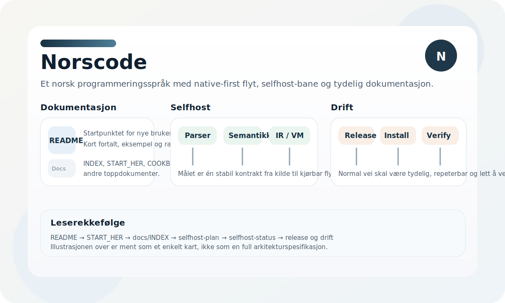

# Norscode

Norscode er eit norsk språk- og verktøysett med native-first CLI, selfhost-løype og ei aktiv flate utan Python eller C.



## Kort fortalt

- Norsk syntaks for funksjonar, kontrollflyt og uttrykk
- Statisk typing for heiltal, tekst, bool, lister og ordbøker
- Modul- og pakke-system
- Standardbiblioteket `std`
- Feilhandtering med `kast`, `prøv` og `fang`
- Normal kjede: `.no` -> NCB JSON -> `selfhost/vm.no`

## Kom i gang

1. Les [docs/INDEX.md](docs/INDEX.md)
2. Les [docs/SELFHOST_HANDLINGSPLAN.md](docs/SELFHOST_HANDLINGSPLAN.md)
3. Sjekk [docs/STATUS.md](docs/STATUS.md)
4. Vedlikehald: `./bin/nc maintenance verify`

Snarvegar:

```bash
./bin/nc --help
./bin/nc run app.no
./bin/nc check app.no
./bin/nc feature-check app.no
./bin/nc test
```

## Normal bruk

- `./bin/nc` og `dist/norscode_native` er normal CLI og runtime
- `./bin/nc feature-check [fil.no ...]` er standard gate for å byggje nye funksjonar direkte i Norscode
- `./bin/nc maintenance verify` gir vedlikehaldssamandrag
- `./bin/nc maintenance status`, `lane`, `seed`, `seed-status` viser Norscode-vedlikehald og stage-0-status
- `./bin/nc maintenance report-json` gir maskinlesbar statusrapport (inkl. `stage0_seed_ok`)
- `bash tools/verify_selvstendighet.sh` verifiserer normalflata uten C-regen eller stage-0 rebuild

## Dokumentasjon

- [docs/INDEX.md](docs/INDEX.md)
- [docs/SELFHOST_HANDLINGSPLAN.md](docs/SELFHOST_HANDLINGSPLAN.md)
- [docs/STATUS.md](docs/STATUS.md)

## Verifisering

- `./bin/nc test` går grønt
- normal verifisering går grønt via `bash tools/verify_selvstendighet.sh`
- aktiv verktøyflate er fri for Python og C; historisk C ligg berre under `archive/`

## Lisens

Apache-2.0. Sjå [LICENSE](LICENSE).

## Forfattar

Jan Steinar Sætre
