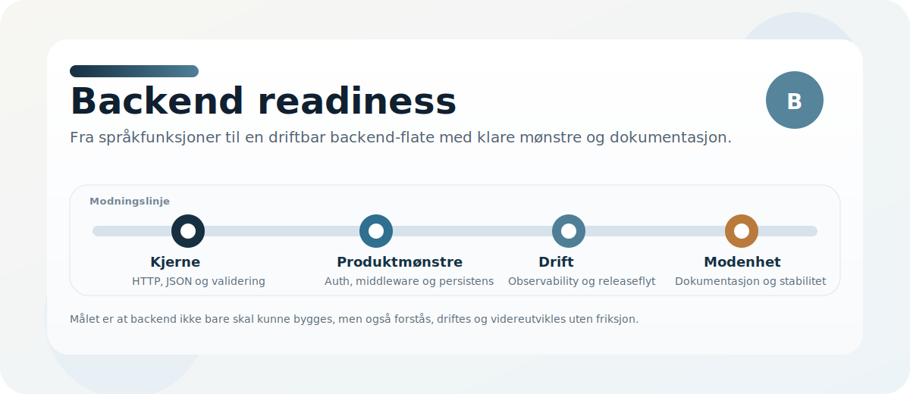

# Backend readiness

Dette er en praktisk status for hvor nær Norscode er å være en fullverdig backend-plattform, ikke bare et språk med web-hjelpere.

## Kort vurdering

- Norscode er backend-klar for mindre og mellomstore tjenester.
- Norscode er ikke ennå helt på nivå med de mest modne backend-rammeverkene.

## På plass

- `std.http` for klient-HTTP
- `std.web` med path-matching, routing, request/response og filrespons
- query-, path- og body-validering
- dependency injection
- `async` og `await`
- JSON-støtte
- strukturert feilhåndtering
- test, lint, format, bench, smoke og fuzz
- Windows-installasjon
- binary-first release- og installasjonsflyt

## Modenhetsområder

- stabil HTTP-server som kan driftes uten utviklerverktøy
- tydelige mønstre for auth, rolle- og tilgangsstyring
- request validation som føles automatisk og forutsigbar
- første klasses støtte for middleware og sikkerhetshjelpere
- rate limiting og brute-force-beskyttelse
- migrering og databaseoppsett som standardisert del av produktet
- transaksjoner som standard
- connection pooling
- repository- eller modelmønstre som er dokumentert og anbefalt
- enkel og tydelig JSON-/schema-mapping
- fil- og objektlagring som standardmønster
- observability og produksjonsdiagnostikk som standard
- dokumentasjon som viser en komplett backend-app fra første request til deploy

## Praktisk konklusjon

Norscode har de viktigste byggesteinene på plass for backend-bruk.
Det som gjenstår er i mindre grad rå funksjonalitet, og mer produktisering, dokumentasjon og driftsklarhet.
