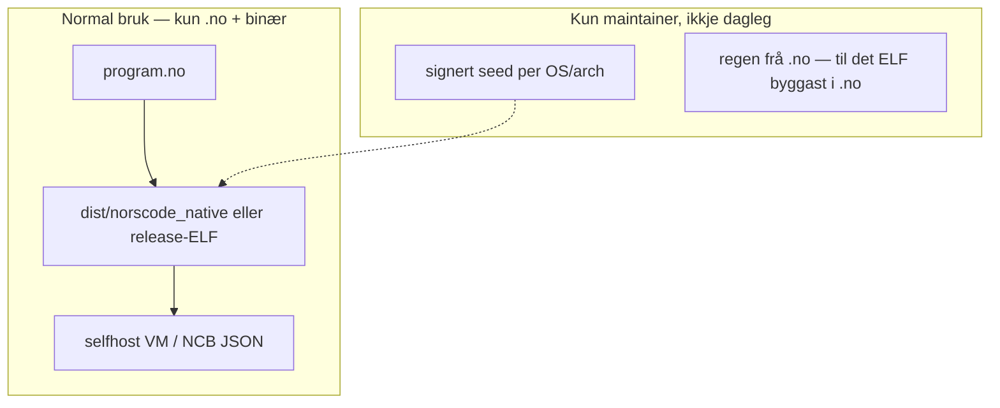

# Plan: fjern Python og legacy-C, start rein normalvei

Operativ plan for å fjerne gjenværende Python og C-spor fra **normal** utvikling, test og CI — og å starte arbeidet i små, verifiserbare steg.

Bygger på [SELVSTENDIGHET_PLAN.md](SELVSTENDIGHET_PLAN.md) og [SELFHOST_HANDLINGSPLAN.md](SELFHOST_HANDLINGSPLAN.md).

## Målbilde (slutt)



| Lag | Fjernes fra repo / normal flyt | Erstattes med |
|-----|-------------------------------|---------------|
| Python | `tools/*.py`, pytest-orakler, bootstrap-wrapper | `.no`-verktøy eller `scripts/` utanfor L1-gate |
| Legacy C-VM | `tools/c_minimal_vm/` | Arkiv + sletting; kun `archive/c_minimal_vm/` som doc |
| Regen-C i dag | `bootstrap/c/*.c` + clang i dagleg loop | Seed-ELF + (seinare) native ELF frå `selfhost/` |
| C-host | `nc_native_main.c` | Mellombels: minimal host; langsiktig: emitter i `.no` |

**Viktig:** Fullstendig **null C i repo** krev at Norscode kan **bygge og kjøre seg sjølv som ELF** utan clang. Det er eit eige spor (Omgang 6). Inntil da: **ingen C/Python i det brukaren og CI kallar dagleg**.

## Inventar i dag (kva «alt» er)

### Python (1 fil)

| Fil | Formål | Handling |
|-----|--------|----------|
| `tools/gen_expr_fraser.py` | Regenerer frase-tabell i `common.no` | Flytt til `scripts/gen_expr_fraser.py` eller implementer i `selfhost/tools.no` |

### C (aktiv + legacy)

| Fil / mappe | Formål | Handling |
|-------------|--------|----------|
| `tools/nc_native_main.c` | NORSCODE_CMD-host, lazy `common.no` | Behold til ELF i `.no`; dokumenter som siste C-grense |
| `tools/nc_runtime_mini.c` | Runtime-bit | Same som over |
| `bootstrap/c/*.c` | Regen frå `.no` (L4/L6) | Allereie ikkje i git som krav; berre seed + regen |
| `tools/c_minimal_vm/*.c` | Eldre C-VM | **Slett** (eller flytt til `archive/`) |
| `tools/build_norscode_native_from_source.sh` | Bygg via c_minimal_vm | **Slett** eller merk deprecated |
| `build/**/*.c` | Regen-artefakt | `.gitignore`, ikkje kilde |

### Merkingar som lyg

| Ting | Problem | Handling |
|------|---------|----------|
| `test_selfhost.no` Python-only i `nc_test.sh` | Køyrer faktisk på native (delvis) | Fullfør skript-API → fjern skip |
| `LANE_MAP.md` → `bootstrap_wrapper.py` | Finst ikkje | Oppdater docs |
| L1 ✅ med `gen_expr_fraser.py` i `tools/` | Gate feiler | Flytt fil før «L1 lukka» på nytt |

## Omganger (start her)

### Omgang 0 — Rydding utan arkitektur (1–2 dager)

**Mål:** Repo og gates svarer sannferdig «ingen Python i tools/».

1. Flytt `tools/gen_expr_fraser.py` → `scripts/gen_expr_fraser.py` (eller `selfhost/dev/gen_expr_fraser.no`).
2. Oppdater `docs/SELFHOST_STATUS.md`, `SELFHOST_STATUS` frase-kommando, ev. `Makefile`-target `regen-fraser`.
3. Køyr `bash tools/python_dependency_audit.sh` → må gi OK.
4. Slett `tools/c_minimal_vm/` (heile mappa).
5. Slett eller arkiver `tools/build_norscode_native_from_source.sh`.
6. Oppdater `docs/LANE_MAP.md`, `SELFHOST_MIGRATION_AND_DEPRECATIONS.md` (fjern døde referansar).

**Ferdig når:**

```bash
bash tools/python_dependency_audit.sh
bash tools/verify_selvstendighet.sh   # L1–L6
sh tools/nc_test.sh                   # 51/51
```

**Verifikasjon:** Ingen `.py` under `tools/`; `find tools/c_minimal_vm` finst ikkje.

---

### Omgang 1 — Lukk expr + test på native (3–5 dager)

**Mål:** `test_selfhost.no` og fraser er heilt på native; ingen Python-only i testløpar.

1. Fullfør `disasm_skript`, `disasm_uttrykk_med_miljo`, `kompiler_fra_kilde` / `kompiler_fra_linjer` i `selfhost/common.no` (eller `script_ir.no`).
2. Køyr `tests/test_selfhost.no` på native; fiks resterande (UTF-8 `på`, skript, `hvis` i uttrykk).
3. Fjern `PYTHON_ONLY_TESTS=test_selfhost.no` frå `tools/nc_test.sh`.
4. (Valgfritt) Splitt `test_selfhost_core.no` (expr) + `test_selfhost_script.no` for rask CI.

**Ferdig når:** `NORSCODE_FILE=tests/test_selfhost.no dist/norscode_native` exit 0 og `nc_test.sh` køyrer den utan skip.

---

### Omgang 2 — C-VM og NCBB heilt ut av dokumentasjon og CI (1 dag)

**Mål:** Ingen referanse til C-VM som vei.

1. Bekreft at ingen workflow/script kallar `c_minimal_vm` eller `ncbb`.
2. Oppdater `ROADMAP.md`, `README.md`, `ARCHIVE_INDEX.md`.
3. CI-gate: `tools/no_legacy_cvm.sh` (grep for `c_minimal_vm` i `tools/` og feil ved treff).

**Ferdig når:** `rg c_minimal_vm tools/` tom (unntak evt. `archive/`).

---

### Omgang 3 — Stage-0 berre seed, ikkje clang i dagleg (1 uke)

**Mål:** Utviklar treng ikkje clang for `run` / `test`.

1. Publiser/signér seed per plattform i `bootstrap/stage0/` + GitHub Release (allerede delvis).
2. `build_norscode_native.sh`: default = last seed; regen+clang kun med `REGEN=1` eller maintainer-flag.
3. Dokumenter i `bootstrap/stage0/README.md`: «clang berre ved regen av stage-0».
4. Legg inn seed-only CI-lane: `bash tools/verify_seed_only.sh` (utan clang/regen).

**Ferdig når:** Ny maskin: `bash tools/build_norscode_native.sh` + `sh tools/nc_test.sh` utan clang installert.

---

### Omgang 4 — Regen-C inn i selfhost (2–4 uker)

**Mål:** `bootstrap/c/` generert utan å vedlikehalde handskriven C-host.

1. Reduser `nc_native_main.c` til tynn FFI (load NCB, kall `start`).
2. Flytt meir logikk til `selfhost/nc_main.no` / `native_execution/`.
3. `regen_native.sh` produserer berre det som **må** vere C (dispatch-tabell) inntil ELF-emitter finst.
4. `regen_verify.sh` grønn i CI på `workflow_dispatch`.

**Ferdig når:** Endring i `selfhost/ncb_to_c.no` → regen → byte-identisk `bootstrap/c/` (L4/L6 grønn).

---

### Omgang 5 — Frase-tabell utan Python (1 uke)

**Mål:** Ingen `.py` i heile repoet for normal vedlikehald.

1. Implementer `regenerer_frase_tabell()` i `.no` (les `tests/test_selfhost.no`, skriv `BEGIN_EXPR_FRASER`-blokk).
2. `./bin/nc run scripts/regen_fraser.no` (eller innebygd `nc maint regen-fraser`).
3. Slett `scripts/gen_expr_fraser.py`.

**Ferdig når:** `find . -name '*.py'` tom (eller berre tredjepart i `.gitignore`).

---

### Omgang 6 — Native ELF utan clang (lang sikt)

**Mål:** Siste C-grense borte.

1. ELF/layout frå `selfhost/native_execution/` (finst delvis).
2. `selfcompile` produserer ny `norscode_native` som er stage-0 for neste runde.
3. Fjern `nc_native_main.c` / `bootstrap/c/` frå normal historie; berre signert bootstrap i release.

**Ferdig når:** L6 + «ingen .c i repo» + grønn `verify_selvstendighet.sh`.

---

## Start i dag (konkrete kommandoar)

```bash
# 0a — status
bash tools/python_dependency_audit.sh || true
find tools -name '*.py' -o -path '*/c_minimal_vm/*' | head

# 0b — etter Omgang 0-endringar
git mv tools/gen_expr_fraser.py scripts/gen_expr_fraser.py   # eksempel
rm -rf tools/c_minimal_vm
bash tools/python_dependency_audit.sh
bash tools/verify_selvstendighet.sh

# 1 — test-selfhost framdrift
NORSCODE_FILE=tests/test_selfhost.no dist/norscode_native
```

## Gates (skal ikkje bli grøne før dei er sanne)

| Gate | Kommando | Krav |
|------|----------|------|
| L1 Python | `tools/python_dependency_audit.sh` | 0 filer i `tools/*.py` |
| L1–L6 | `tools/verify_selvstendighet.sh` | grønn |
| Tester | `sh tools/nc_test.sh` | 0 feil; 0 falsk Python-only |
| Legacy C-VM | `rg c_minimal_vm tools` | ingen treff |
| Monolitt | native `test_selfhost.no` | exit 0 |

## Kva vi **ikkje** gjør i denne planen

- Slette `dist/norscode_native` eller slutte å shippe binærar (brukarane treng stage-0).
- Fjerne `selfhost/ncb_to_c.no` før Omgang 4 er verifisert (regen kollapsar).
- Merke alt ✅ i `SELFHOST_STATUS.md` utan gates over.

## Dokumentasjon å oppdatere undervegs

- [SELFHOST_STATUS.md](SELFHOST_STATUS.md) — etter Omgang 1 og 3
- [SELVSTENDIGHET_PLAN.md](SELVSTENDIGHET_PLAN.md) — legg til Omgang F0–F6 referanse
- [LANE_MAP.md](LANE_MAP.md) — fjern døde lenker
- [ARCHIVE_INDEX.md](ARCHIVE_INDEX.md) — `c_minimal_vm` kun som historikk

## Kort sannhetsregel

**Kortare normalvei = færre språk i kritiske steg.**

**Omgang 0:** ✅ (2026-06) — `scripts/gen_expr_fraser.py`, `tools/c_minimal_vm/` og `build_norscode_native_from_source.sh` fjerna; `no_legacy_cvm.sh` + oppdaterte docs.

**Omgang 1:** ✅ (2026-06) — `tests/test_selfhost.no` grønn på `dist/norscode_native` (111/111 testar, inkl. monolitt); `PYTHON_ONLY_TESTS`-skip fjerna frå `tools/nc_test.sh`; `kompiler_fra_linjer`, `kompiler_fra_kilde`, nested `hvis`-IR, skript-validering og norsk/engelsk alias-støtte lagt til `selfhost/common.no`.

**Omgang 2:** ✅ (2026-06) — CI gate køyrer `tools/no_legacy_cvm.sh`; `tools/` er fri for `c_minimal_vm`-referansar; NCBB-namn i `tools/generate_build_embed_c.sh` er rydda til NCB.

**Omgang 3:** ✅ (2026-06) — seed-first default i `build_norscode_native.sh`; regen+clang berre ved `REGEN=1`; seed-only lane (`tools/verify_seed_only.sh`) køyrer i CI utan clang-install og passerer med native testløp.

**Omgang 4:** ✅ (2026-06) — `selfhost/nc_main.no` er standard host (ikkje lenger opt-in); `l5b-gen2`-kommandoen flytta til `.no`; C `main()` er tynna ned til éin delegering; ny FFI `host_kall_bygg_bundle` la det siste kommandoet flytte ut av C. `NORSCODE_USE_NC_MAIN`-flagget fjerna. Verifiser: `bash tools/verify_nc_main_host.sh`.

**Omgang 5:** ✅ (2026-06) — `scripts/regen_fraser.no` erstatter `scripts/gen_expr_fraser.py`; `scripts/gen_expr_fraser.py` sletta; `find . -name '*.py'` gjev tom liste; identisk phrase-tabell (338 fraser); `./bin/nc regen-fraser` som ny CLI-kommando. Testsuite grønn etter regen.

**Omgang 6 (pågår):** Grunnlag og ny runtime lagt: (1) kompilatorbug `INDEX_SET` utan `POP` fiksa; (2) `native_codegen.no` emit_data_op-bug fiksa; (3) `tools/nc_runtime_full.c` — komplett NcVal-runtime (994 linjer, x86-64 Linux, ingen libc): skriv, fil-I/O, JSON, map/liste/streng-ops, miljø; (4) `native_codegen_v2.no` — ny kodegenerator som brukar NcVal-runtime, produserer ~20KB ELF64; (5) `./bin/nc bygg-native` no standardkommando. Testar: 114/114 grøne. Gjenstår: Linux-køyreverifikasjon (krev Docker/CI), fjerne .c-filer frå git.

Neste steg: **Omgang 6** — utvid `bygg_runtime()` med map/string/fil/json-ops, test ELF på Linux.
