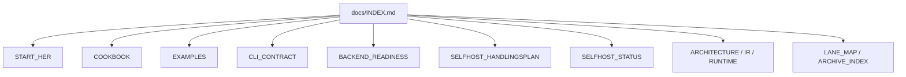
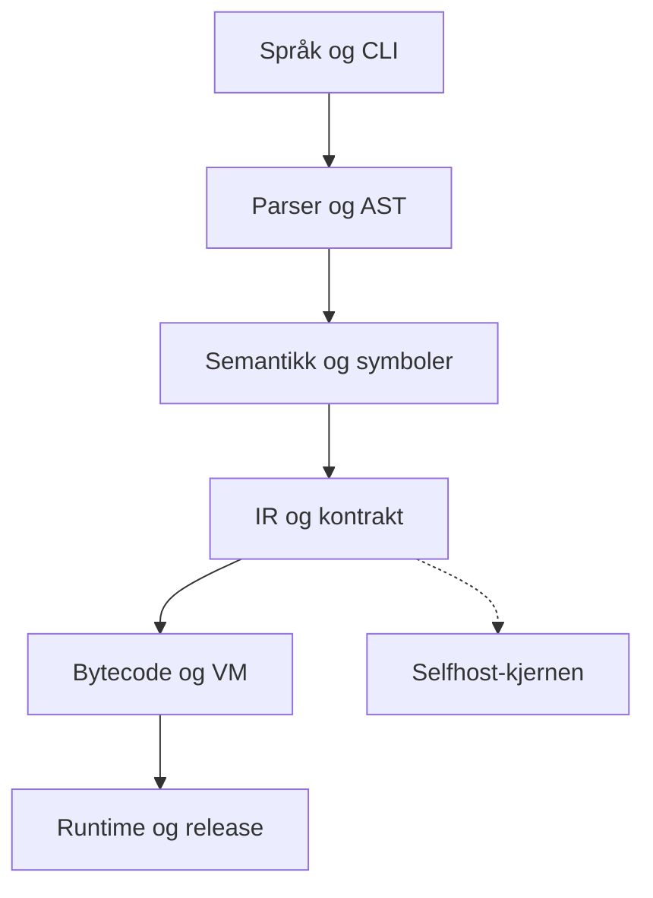

# Norscode Documentation

Dette er startpunktet for dokumentasjonen.

Bruk denne siden som inngang hvis du vil finne riktig dokument raskt uten å lese alt først.

## Dokumentkart

## Arkitektur

## Start Here

- [START_HER](START_HER.md) - raskeste vei inn for nye brukere
- [COOKBOOK](COOKBOOK.md) - praktiske oppskrifter og mønstre
- [EXAMPLES](EXAMPLES.md) - representative eksempler
- [CLI_CONTRACT](CLI_CONTRACT.md) - stabil CLI-kontrakt

## Learn

- [FRONTEND_LEARNING_PATH](FRONTEND_LEARNING_PATH.md) - leserekkefølge for frontend
- [FRONTEND_MODEL](FRONTEND_MODEL.md) - valgt frontend-modell
- [FRONTEND_MODES](FRONTEND_MODES.md) - HTML mode, component mode og native UI
- [BACKEND_READINESS](BACKEND_READINESS.md) - status for backend-sporet
- [SELFHOST_HANDLINGSPLAN](SELFHOST_HANDLINGSPLAN.md) - handlingsplan for selvstendighet

## Reference

- [QUALITY](QUALITY.md) - kvalitetskrav og terskler
- [MAINTENANCE_POLICY](MAINTENANCE_POLICY.md) - vedlikeholdsregler
- [DEPLOYMENT_PLAYBOOK](DEPLOYMENT_PLAYBOOK.md) - drift og deploy
- [SELFHOST_STATUS](SELFHOST_STATUS.md) - gjeldende status
- [SELFHOST_RELEASE_CHECKLIST](SELFHOST_RELEASE_CHECKLIST.md) - release-sjekkliste

## Architecture

- [ARCHITECTURE_V2](ARCHITECTURE_V2.md) - overordnet arkitektur
- [COMPILER_STRUCTURE](COMPILER_STRUCTURE.md) - struktur for compiler-delene
- [COMPILER_PIPELINE](COMPILER_PIPELINE.md) - kompilatorflyt
- [RUNTIME_ARCHITECTURE](RUNTIME_ARCHITECTURE.md) - runtime-arkitektur
- [IR_CONTRACT](IR_CONTRACT.md) - kanonisk IR-kontrakt

## History and Archive

- [LANE_MAP](LANE_MAP.md) - aktiv vei, bootstrap/legacy og historikk
- [ARCHIVE_INDEX](ARCHIVE_INDEX.md) - historiske dokumenter og migrering
- [SELFHOST_MIGRATION_AND_DEPRECATIONS](SELFHOST_MIGRATION_AND_DEPRECATIONS.md) - migrering og deprecation

## Conventions

- Nye brukere starter i [START_HER](START_HER.md)
- Den aktive handlingsplanen er [SELFHOST_HANDLINGSPLAN](SELFHOST_HANDLINGSPLAN.md)
- Arkiv brukes bare når du trenger historikk, migrering eller utfasing
- Hvis du er usikker på hvor noe hører hjemme, legg det først i riktig gruppe her og lenk videre derfra
