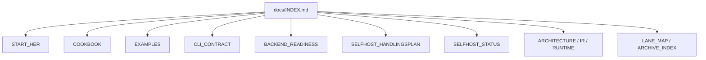
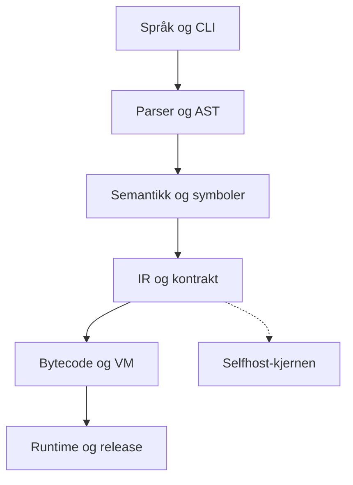

# Norscode Documentation

Dette er startpunktet for dokumentasjonen.

Bruk denne siden som inngang hvis du vil finne riktig dokument raskt uten å lese alt først.

## Dokumentkart

## Arkitektur

## Start Here

- [START_HER](START_HER.md) - raskeste vei inn for nye brukere
- [COOKBOOK](COOKBOOK.md) - praktiske oppskrifter og mønstre
- [EXAMPLES](EXAMPLES.md) - representative eksempler
- [CLI_CONTRACT](CLI_CONTRACT.md) - stabil CLI-kontrakt

## Learn

- [FRONTEND_LEARNING_PATH](FRONTEND_LEARNING_PATH.md) - leserekkefølge for frontend
- [FRONTEND_MODEL](FRONTEND_MODEL.md) - valgt frontend-modell
- [FRONTEND_MODES](FRONTEND_MODES.md) - HTML mode, component mode og native UI
- [BACKEND_READINESS](BACKEND_READINESS.md) - status for backend-sporet
- [SELFHOST_HANDLINGSPLAN](SELFHOST_HANDLINGSPLAN.md) - handlingsplan for selvstendighet
- [SELVSTENDIGHET_OMGANGER](SELVSTENDIGHET_OMGANGER.md) - operativ sluttplan i små omganger
- [HELPDESK_OMGANGER](HELPDESK_OMGANGER.md) - iterativ plan for Helpdesk-API og admin-arbeid
- [REGISTRY_PLAN](REGISTRY_PLAN.md) - status og plan for å fullføre Norscode registryet
- [PACKAGES](PACKAGES.md) - praktisk quickstart og eksempel for pakker
- [REGISTRY_QUICKSTART](REGISTRY_QUICKSTART.md) - kort vei frå manifest til publish og install
- [REGISTRY_EXAMPLE](REGISTRY_EXAMPLE.md) - konkret eksempel med to pakkar og lokal utvikling
- [REGISTRY_TUTORIAL](REGISTRY_TUTORIAL.md) - steg-for-steg tutorial for heile registry-flyten
- [MODENHETSPLAN](MODENHETSPLAN.md) - konkret plan for kva som manglar og kva som bør fiksast først
- [SHORT_SYNTAX_DESIGN](SHORT_SYNTAX_DESIGN.md) - designnote for kortare funksjonssyntaks
- [SHORT_MANIFEST_DESIGN](SHORT_MANIFEST_DESIGN.md) - designnote for kortare norcode.toml
- [SHORT_FORMS_COMPARISON](SHORT_FORMS_COMPARISON.md) - samanlikning av korte former og anbefalt rekkefølge
- [SHORT_FORMS_IMPLEMENTATION_PLAN](SHORT_FORMS_IMPLEMENTATION_PLAN.md) - konkret plan for å innføre korte former
- [API_SCAFFOLD](API_SCAFFOLD.md) - start nytt Norscode-prosjekt med `nc startproject`
- [STARTAPP](STARTAPP.md) - opprett app-modular med `nc startapp`
- [MAC_APP_OMGANGER](MAC_APP_OMGANGER.md) - plan for ekte macOS app-bundle og distribusjon
- [MAC_NATIVE_WINDOW_OMGANGER](MAC_NATIVE_WINDOW_OMGANGER.md) - plan for ekte macOS-vindauge med Norscode-backend, ikkje berre Terminal-launch
- [LINUX_APP_OMGANGER](LINUX_APP_OMGANGER.md) - plan for Linux app-/pakke-distribusjon utover rein binær
- [WINDOWS_APP_OMGANGER](WINDOWS_APP_OMGANGER.md) - plan for Windows native `.exe`, installer og release-linje
- [WINDOWS_APP_RELEASE](WINDOWS_APP_RELEASE.md) - første ZIP-/checksum-kontrakt for Windows native `.exe`-sporet
- [WINDOWS_APP_LAYOUT](WINDOWS_APP_LAYOUT.md) - første app-layout rundt Windows native `.exe`
- [WINDOWS_APP_INSTALL](WINDOWS_APP_INSTALL.md) - første repeterbare installasjons- og oppgraderingsløype for Windows ZIP-layout
- [WINDOWS_APP_CI](WINDOWS_APP_CI.md) - første CI- og GitHub Release-linje for Windows ZIP-layouten
- [WINDOWS_APP_GAP_STATUS](WINDOWS_APP_GAP_STATUS.md) - kort sannheitsstatus for kva som er ferdig, delvis og manglar på Windows
- [WINDOWS_APP_SLUTTRAPPORT](WINDOWS_APP_SLUTTRAPPORT.md) - kort sluttrapport for primær Windows-distribusjon og attverande blokkeringar
- [LINUX_APP_RELEASE](LINUX_APP_RELEASE.md) - første Linux AppDir-/AppImage-linje utover rein binær
- [LINUX_APP_DESKTOP](LINUX_APP_DESKTOP.md) - lokal `.desktop`- og ikonintegrasjon for Linux-appsporet
- [LINUX_APP_INSTALL](LINUX_APP_INSTALL.md) - første repeterbare installasjonsløype for Linux AppDir-artefakt
- [LINUX_APP_CI](LINUX_APP_CI.md) - CI-linje for Linux app-artefakt
- [LINUX_APP_GAP_STATUS](LINUX_APP_GAP_STATUS.md) - kort sannheitsstatus for Linux app-sporet
- [LINUX_APP_SLUTTRAPPORT](LINUX_APP_SLUTTRAPPORT.md) - kort sluttrapport for primær og sekundær Linux-distribusjon
- [MAC_APP_SIGNING](MAC_APP_SIGNING.md) - lokal signering, verifikasjon og notarization-sti for macOS-appen
- [MAC_APP_RELEASE](MAC_APP_RELEASE.md) - lokal releasepakking for macOS-appen
- [MAC_APP_CI](MAC_APP_CI.md) - CI-linje for macOS app-artefakt
- [MAC_APP_TEMPLATE](MAC_APP_TEMPLATE.md) - prosjektmal og app-kontrakt for andre Norscode-baserte Mac-appar
- [MAC_APP_GAP_STATUS](MAC_APP_GAP_STATUS.md) - kort sannheitsstatus for kva som er ferdig, delvis og manglar
- [MAC_APP_APPLE_SECRETS_CHECKLIST](MAC_APP_APPLE_SECRETS_CHECKLIST.md) - siste operative steg for Developer ID og notarization i GitHub Actions
- [MAC_NATIVE_WINDOW_SLUTTRAPPORT](MAC_NATIVE_WINDOW_SLUTTRAPPORT.md) - kort sluttrapport for overgangen fraa Terminal-app til ekte macOS-vindauge

## Reference

- [QUALITY](QUALITY.md) - kvalitetskrav og terskler
- [API_EXPLORER](API_EXPLORER.md) - interaktiv OpenAPI-dokumentasjon og request explorer
- [REGISTRY_API](REGISTRY_API.md) - registry-format, API og lockfile-kontrakt
- [REGISTRY_PROTOCOL](REGISTRY_PROTOCOL.md) - protokollspec for registry og publisering
- [MAINTENANCE_POLICY](MAINTENANCE_POLICY.md) - vedlikeholdsregler
- [DEPLOYMENT_PLAYBOOK](DEPLOYMENT_PLAYBOOK.md) - drift og deploy
- [SELFHOST_STATUS](SELFHOST_STATUS.md) - gjeldende status
- [SELFHOST_RELEASE_CHECKLIST](SELFHOST_RELEASE_CHECKLIST.md) - release-sjekkliste

## Architecture

- [ARCHITECTURE_V2](ARCHITECTURE_V2.md) - overordnet arkitektur
- [COMPILER_STRUCTURE](COMPILER_STRUCTURE.md) - struktur for compiler-delene
- [COMPILER_PIPELINE](COMPILER_PIPELINE.md) - kompilatorflyt
- [RUNTIME_ARCHITECTURE](RUNTIME_ARCHITECTURE.md) - runtime-arkitektur
- [IR_CONTRACT](IR_CONTRACT.md) - kanonisk IR-kontrakt

## History and Archive

- [LANE_MAP](LANE_MAP.md) - aktiv vei, bootstrap/legacy og historikk
- [ARCHIVE_INDEX](ARCHIVE_INDEX.md) - historiske dokumenter og migrering
- [SELFHOST_MIGRATION_AND_DEPRECATIONS](SELFHOST_MIGRATION_AND_DEPRECATIONS.md) - migrering og deprecation

## Conventions

- Nye brukere starter i [START_HER](START_HER.md)
- Den aktive handlingsplanen er [SELFHOST_HANDLINGSPLAN](SELFHOST_HANDLINGSPLAN.md)
- Arkiv brukes bare når du trenger historikk, migrering eller utfasing
- Hvis du er usikker på hvor noe hører hjemme, legg det først i riktig gruppe her og lenk videre derfra
- [STARTAPP](STARTAPP.md) - opprett app-modular med `nc startapp`
