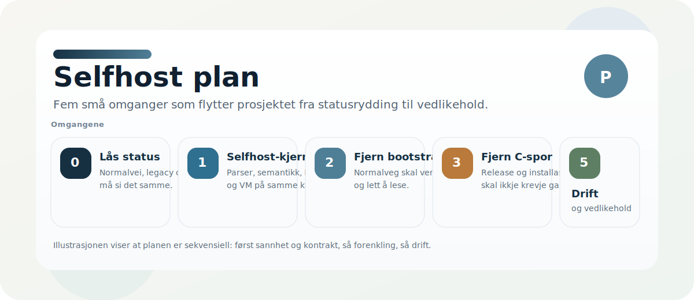

# Norscode - handlingsplan i omganger

Denne planen beskriver hvordan vi gjør Norscode selvstendig i normal utvikling, bygging, testing, kjøring og publisering.
Den er operativ, ikke historisk: hver omgang skal være liten nok til å fullføres, verifiseres og forklares uten friksjon.

## Hva vi mener med selvstendig

Norscode er selvstendig når:

- `./bin/nc run`, `test`, `check`, `build` og release-flyt bruker native eller selfhost som normalvei
- den gamle bootstrap-flaten bare finnes som tydelig historikk eller eksplisitt legacy hvis den fortsatt trengs midlertidig
- den gamle backend-veien ikke lenger er nødvendig for normal bruk
- CI verifiserer bootstrap, selfhost, release og regresjoner uten skjulte bakdører
- nye bidragsytere ser normal vei, avvik og historikk uten å måtte lese kildekoden først

### Ingen Python eller C i normal flyt

| Tillatt | Ikke tillatt i normal flyt |
|---|---|
| `.no` → NCB JSON → `selfhost/vm.no` | Nye `tools/*.py` som kompilerer, konverterer eller kjører kjerne |
| `dist/norscode_native` som **stage-0** (release-binær eller selfhost-kompilert ELF) | `python3 main.py`, pytest som orakel for kompilatoren |
| `tools/c_minimal_vm/` kun som **arkivert** legacy (ikke dokumentert som vei) | NCBB/C-VM som påkrevd steg for `run` / `compile` / CI |
| Nye verktøy i `selfhost/*.no` | `selfhost/ncb_to_c.no` i produksjonskjede |

**Artefaktformat:** Kjøring og bootstrap bruker **NCB JSON** (`*.ncb.json`). Binært NCBB hører til legacy C-VM og skal ikke gjeninnføres via Python eller nye C-verktøy. Trengs binær serialisering senere, implementeres den i Norscode (`selfhost/…`), ikke i `tools/*.py`.

**Stage-0-unntak:** Én ferdig `norscode_native` per plattform (hentes med `tools/build_norscode_native.sh` eller bygges én gang fra selfhost). Det er bootstrap, ikke daglig avhengighet av clang eller Python.

## Omgangsregel

Hver omgang skal være liten nok til å:

- fullføres i én arbeidsøkt
- verifiseres lokalt
- oppsummeres i noen få linjer

Hvis en endring krever flere store arkitekturspor samtidig, er den for stor og skal splittes opp.

## Omgang 0 - Lås dagens status

Mål:
Gjøre status, verktøy og dokumentasjon konsistente nok til at resten kan bygge videre uten tvetydighet.

Leveranser:

- `bin/nc` og `bin/bootstrap` peker tydelig mot native-first flyt
- aktiv dokumentasjon beskriver normal vei først og historikk eller legacy tydelig etterpå
- statusdokumenter sier klart hva som fortsatt er delvis ferdig
- verifikasjonsskript kan kjøres uten manuell tolkning

Ferdig når:

- det er tydelig hva som er normal bruk og hva som er historikk
- fase- og statusdokumentene ikke motsier hverandre

## Omgang 1 - Fullfør selfhost-kjernen

Mål:
Få parser, semantikk, IR og VM til å dele én stabil kontrakt.

Leveranser:

- tydelig IR-kontrakt for `PUSH`, `ADD`, `PRINT`, `HALT`, `NOT`, `OR`, `SWAP` og `OVER`
- stabil parser- og AST-kontrakt
- stabil semantic- og symbolkontrakt
- stabil bytecode- og VM-kontrakt
- selfhost-parity-tester for kjerneeksempler

Ferdig når:

- `selfhost/main.no` kan kompilere kjernepipelinen deterministisk
- selfhost og bootstrap følger samme kontrakter for de viktige tilfellene

## Omgang 2 - Fjern den gamle bootstrap-flaten fra normal flyt

Mål:
Gjøre den gamle bootstrap-flaten til historikk eller eksplisitt legacy, ikke normal vei.

Leveranser:

- `run`, `test`, `check` og `build` går native i normal flyt
- legacy-flater er tydelig merket og ligger utenfor normal bruk
- README, startdokumenter og CI-dokumentasjon beskriver native først
- CI stopper hvis normal vei prøver å bruke fallback-banen
- release/install-flaten krever ikke C-verktøykjede i normal drift

Ferdig når:

- vanlig utvikling kan foregå uten at den gamle banen trengs
- den gamle banen trengs bare for uttrykkelig legacy eller historisk reproduksjon

## Omgang 3 - Fjern den gamle backend-veien fra normal flyt

Mål:
Gjøre C til et eventuelt legacy- eller eksperimentspor, ikke et krav.

Leveranser:

- bytecode og VM er normal kjørevei
- installasjon og release krever ikke den gamle verktøykjeden
- C-spor er flyttet ut av normal dokumentasjon og normal installasjon

Ferdig når:

- nye brukere kan bygge og kjøre Norscode uten C-verktøykjede

## Omgang 4 - Rydd historikk, docs og drift

Mål:
Fjerne ballast som bare finnes for å forklare en tidligere verden.

Leveranser:

- historiske dokumenter er tydelig arkiv og ikke normal referanse
- gjenstående aliaser og gamle navn er samlet på ett sted
- README, START_HER, HANDOFF, CLI_CONTRACT og roadmap peker samme vei
- migrering og deprecation har tydelige sluttpunkter

Ferdig når:

- nye bidragsytere møter en enkel og sannferdig dokumentasjonsflate

## Omgang 5 - Lås vedlikehold og drift

Mål:
Sørge for at selvstendigheten holder seg selv ved like.

Leveranser:

- verifikatorer for bootstrap, selfhost og release
- regresjonsvern i CI
- feilmeldinger og diagnostikk som peker mot riktig lag
- rutiner som fanger opp ny legacy tidlig

Ferdig når:

- endringer som gjeninnfører skjult avhengighet blir stoppet tidlig

## Anbefalt rekkefølge

1. Lås status og dokumentasjon
2. Fullfør selfhost-kjernen
3. Fjern den gamle bootstrap-flaten fra normal flyt
4. Fjern den gamle backend-veien fra normal flyt
5. Rydd historikk og docs
6. Lås vedlikehold og drift

## Kort sannhetsregel

Hvis en endring gjør at en ny bidragsyter må spørre "hvilken skjult vei er riktig i dag?", er vi ikke ferdige.
Hvis en endring gjør normal vei kortere og legacy tydeligere, går vi i riktig retning.
