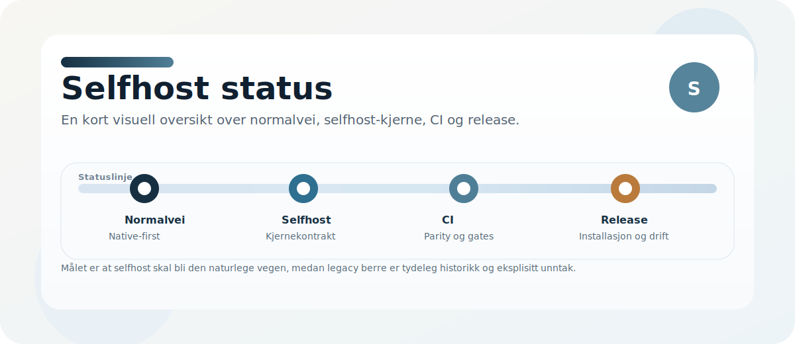
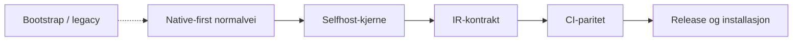
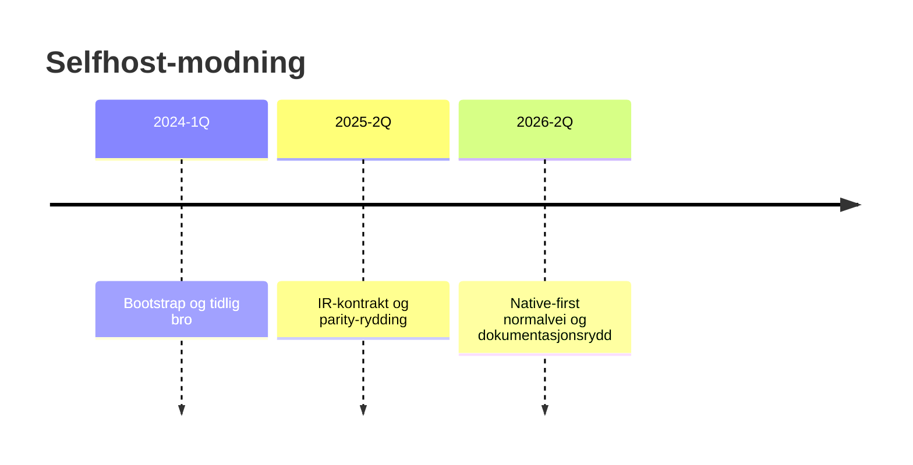

# Selfhost status

Denne siden oppsummerer hvor langt Norscode har kommet mot en selvstendig selfhost-flate, og hva som fortsatt blokkerer en helt ren normalvei.

## Mål

Norscode skal kunne kompilere, teste og kjøre seg selv uten at en eldre bootstrap-runtime er normal vei.

## Flyt

## Statuslinje

## Selvstendighet (L1–L6)

| Nivå | Status | Verktøy |
|------|--------|---------|
| L1–L3 | ✅ | `verify_selvstendighet.sh`, `bootstrap-self` |
| L4–L6 | ✅ | `regen_native.sh`, `verify_l6.sh`, seed → regen → clang |
| L5 / L5b | ✅ | `selfcompile_l5.sh`, `selfcompile_l5b.sh` |

Detaljar: [SELVSTENDIGHET_PLAN.md](SELVSTENDIGHET_PLAN.md). Legacy C-VM: [archive/c_minimal_vm/README.md](../archive/c_minimal_vm/README.md).

## Statusoversikt

| Område | Status | Kommentar |
|---|---|---|
| CLI og binærflyt | ✅ | `dist/norscode_native` + `bin/nc` er normal vei. `bin/bootstrap` er bevisst bootstrap-flate (unntak). |
| Parser-paritet | ✅ | `tests/test_parser_precedence_matrix.no` kjører på native; øvrig parser-dekning via `test_selfhost_*` og CI. |
| IR-disasm | ✅ | `selfhost/common.no` + lazy-load i `nc_native_main.c`; implikasjon følger [IR_CONTRACT.md](IR_CONTRACT.md) (`SWAP NOT SWAP OR`). |
| Uttrykksparsing | ✅ | `tokeniser_uttrykk`, norske operatorar/fraser (`scripts/regen_fraser.no`), `->` / `=>` / `<-`, implikasjonsalias. |
| IR fra kilde | ✅ | `disasm_fra_kilde` / `*_strict`, `kompiler_fra_tokens` / `kompiler_fra_kilde_strict`. |
| Testsystem | ✅ | `tools/nc_test.sh`: 111/111 native (øvrige hopp er server/async). `test_selfhost.no` (monolitt ~4000 linjer) passerer native utan skip. |
| Web og runtime | ✅ | Web-eksempler og stdlib bygges på native/CI; full nett-server-runtime er egen flate (server-tester hoppes i `nc_test.sh`). |
| Pakking og release | ✅ | Release-binær og `verify_l6.sh`; installasjon utan C-verktøykjede er dokumentert. |

## Kjente avvik

### IR snapshot-paritet

Enkelte `.nlir`-cases kan fortsatt mangle full linjeparser i den store compiler-kjernen; expr/IR-broen i `common.no` er grønn.

## Prioritet nå

1. Omgang 4: reduser C-host til tynn FFI og flytt meir logikk til `.no`.
2. Hald regen-C til minimum (dispatch + nødvendige shim) fram til ELF-emitter i `.no`.
3. Fjern gjenværende snapshot-orakler der selfhost-output er stabil.
4. Hold `ir-disasm --strict` og CI på same kontrakt som [IR_CONTRACT.md](IR_CONTRACT.md).

## Kontrakt og implementasjon

- [docs/IR_CONTRACT.md](IR_CONTRACT.md)
- [selfhost/ir_contract.no](../selfhost/ir_contract.no)
- [selfhost/common.no](../selfhost/common.no) — expr-IR, tokenisering, disasm/kompiler-bro
- [scripts/regen_fraser.no](../scripts/regen_fraser.no) — regenererer frase-tabell i `common.no` (dev, utanfor `tools/`)

## Regler for nye endringer

- Nye compiler-features skal ha selfhost-sjekk eller en eksplisitt selfhost-plan.
- Historiske referanser skal merkes som arkiv eller legacy hvis de ikke har en selfhost-ekvivalent.
- `bin/bootstrap` er en eksplisitt bootstrap-flate; normal bruk går via `dist/norscode` og `bin/nc`.
- CI-feil skal ikke løses ved å senke krav uten dokumentert grunn.
- Målet er færre historiske avhengigheter for hver fase.

## Les videre

- [docs/LANE_MAP.md](LANE_MAP.md)
- [docs/SELFHOST_MIGRATION_AND_DEPRECATIONS.md](SELFHOST_MIGRATION_AND_DEPRECATIONS.md)
- [docs/SELFHOST_DIAGNOSTICS.md](SELFHOST_DIAGNOSTICS.md)
- [docs/SELFHOST_CI_GATES.md](SELFHOST_CI_GATES.md)
- [docs/SELFHOST_RELEASE_CHECKLIST.md](SELFHOST_RELEASE_CHECKLIST.md)
- [docs/SELFHOST_FALLBACK_CONTRACT.md](SELFHOST_FALLBACK_CONTRACT.md)
- [docs/ARCHIVE_INDEX.md](ARCHIVE_INDEX.md)
- [docs/SELFHOST_HANDLINGSPLAN.md](SELFHOST_HANDLINGSPLAN.md)
