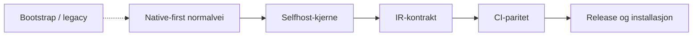
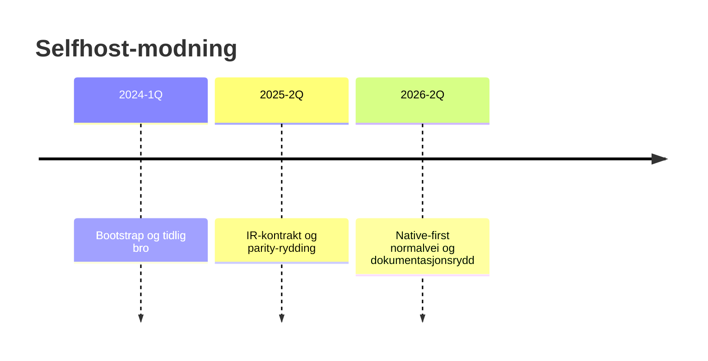

# Selfhost status

Denne siden oppsummerer hvor langt Norscode har kommet mot en selvstendig selfhost-flate, og hva som fortsatt blokkerer en helt ren normalvei.


## Mål

Norscode skal kunne kompilere, teste og kjøre seg selv uten at en eldre bootstrap-runtime er normal vei.

## Flyt



## Statuslinje



## Statusoversikt

| Område | Status | Kommentar |
|---|---|---|
| CLI og binærflyt | Delvis | `dist/norscode` og `bin/nc` finnes; `bin/bootstrap` er fortsatt en eksplisitt bootstrap-flate. |
| Parser-paritet | Overvåkes | Parity er god på de fleste dekkede tilfellene, men CI viser fortsatt enkelte avvik nedstrøms. |
| IR-disasm | Delvis | Selfhost og historisk forventning er ikke fullt samstemt på strict IR-cases. |
| Uttrykksparsing | Delvis | Enkelte uttrykk, som `1 -> 0`, har fortsatt kontraktssplitt mellom forventning og implementasjon. |
| IR fra kilde | Delvis | Noen snapshot-cases gir tom selfhost-output der historisk forventning har konkret bytecode. |
| Testsystem | Delvis | Testene kjører, men enkelte parity-løp er fortsatt bundet til historiske orakler. |
| Web og runtime | Tidlig | Web-eksempler kompilerer, men dette er ikke en ferdig selfhost-runtime. |
| Pakking og release | Delvis | Release-pakker finnes, og normal installasjon kan skje uten C-verktøykjede. |

## Kjente avvik

### `test_selfhost.no`

Det finnes fortsatt en mismatch i hvordan implication og operator-disasm skrives ut:

```text
0: PUSH 1
1: PUSH 0
2: SWAP
3: NOT
4: SWAP
5: OR
6: PRINT
7: HALT
```

mot

```text
0: PUSH 1
1: PUSH 0
2: NOT
3: OR
4: PRINT
5: HALT
```

Dette må løses som én offisiell IR-kontrakt, og deretter bør både selfhost og historiske referanser følge samme linje.

### IR snapshot-paritet

Enkelte `.nlir`-cases gir tom output i selfhost der historisk forventning gir `PUSH`, `ADD`, `PRINT` og `HALT`.

Det peker på at selfhost fortsatt mangler helt full linjeparser eller strict-disasm-logikk for IR.

## Prioritet nå

1. Lås én tydelig IR-kontrakt for `->`, `NOT`, `OR`, `SWAP`.
2. Implementer ekte `.nlir`-tokenisering og parsing i selfhost.
3. Gjør `ir-disasm --strict` konsistent mellom selfhost og historisk forventning.
4. Fjern hardkodede snapshot-orakler der det er mulig.
5. Flytt neste del av compiler til selfhost først når IR-disasm er grønn.

## Kontrakt og implementasjon

- [docs/IR_CONTRACT.md](IR_CONTRACT.md)
- [selfhost/ir_contract.no](../selfhost/ir_contract.no)

Det viktigste som gjenstår i denne omgang er at resten av selfhost-flaten bruker samme kontrakt konsekvent, særlig strict-disasm og snapshot-paritet.

## Regler for nye endringer

- Nye compiler-features skal ha selfhost-sjekk eller en eksplisitt selfhost-plan.
- Historiske referanser skal merkes som arkiv eller legacy hvis de ikke har en selfhost-ekvivalent.
- `bin/bootstrap` er en eksplisitt bootstrap-flate; normal bruk går via `dist/norscode` og `bin/nc`.
- CI-feil skal ikke løses ved å senke krav uten dokumentert grunn.
- Målet er færre historiske avhengigheter for hver fase.

## Les videre

- [docs/LANE_MAP.md](LANE_MAP.md)
- [docs/SELFHOST_MIGRATION_AND_DEPRECATIONS.md](SELFHOST_MIGRATION_AND_DEPRECATIONS.md)
- [docs/SELFHOST_DIAGNOSTICS.md](SELFHOST_DIAGNOSTICS.md)
- [docs/SELFHOST_CI_GATES.md](SELFHOST_CI_GATES.md)
- [docs/SELFHOST_RELEASE_CHECKLIST.md](SELFHOST_RELEASE_CHECKLIST.md)
- [docs/SELFHOST_FALLBACK_CONTRACT.md](SELFHOST_FALLBACK_CONTRACT.md)
- [docs/ARCHIVE_INDEX.md](ARCHIVE_INDEX.md)
- [docs/SELFHOST_HANDLINGSPLAN.md](SELFHOST_HANDLINGSPLAN.md)
